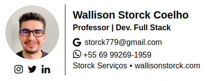

<h1 align="center">
  
</h1>

  <a href="#-projeto">Projeto</a>&nbsp;&nbsp;&nbsp;|&nbsp;&nbsp;&nbsp;
  <a href="#-tecnologias">Tecnologias</a>
 

 

  

 

## 💻 Projeto

**Assinatura de E-mail Personalizada**

Este projeto apresenta uma assinatura de e-mail personalizada desenvolvida de forma única e personalizada para atender às necessidades e preferências individuais. A assinatura inclui elementos visuais, como uma imagem de perfil redonda e ícones de redes sociais, além de informações profissionais e de contato.

**Características:**

- Imagem de perfil redonda com borda circular.
- Ícones de redes sociais vinculados a perfis correspondentes.
- Informações profissionais, incluindo nome, título e especialidade.
- Detalhes de contato, como endereço de e-mail e números de telefone.
- Links clicáveis que direcionam para os perfis de redes sociais e sites.

**Como Utilizar:**

1. Copie o código HTML fornecido no README.
2. Cole o código na assinatura de e-mail do seu cliente de e-mail preferido.
3. Ajuste conforme necessário para atender às suas preferências e informações específicas.

 

## ✨ Tecnologias

Esse projeto foi desenvolvido com as seguintes tecnologias:

- HTML
- CSS
  - FlexBox
  - Grid Layout

---
